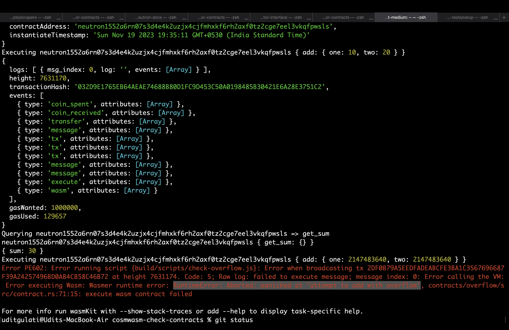
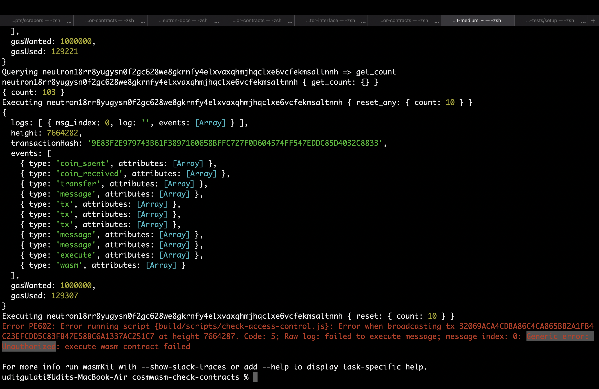

# CosmWasm check contracts

This project is a collections of contracts that fail at runtime with issues that can be checked at compile time and informed to the contract developer.

## Contracts present

1. `overflow`: This contract executes an addition transaction that results in integer overflow.
2. `access-control`: This contract executes `reset` and `reset_any` transaction, one has `"Unauthorized"` check and another doesn't.

## Compiling contracts

To compile your contracts, do `wasmkit compile`

## Run scripts

To run a script, do `wasmkit run scripts/<script-name>.ts`

## Snapshots

1. Overflow: 

  

2. Access control: 

  

